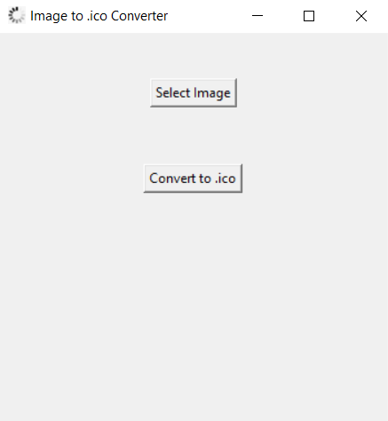

# vinnie-public-repo_convert-image
Hello [world!] folks! This is one of my public repositories to expose some of my works! Have fun!

# Image to ICO Converter



**Convert image files into ICO (Icon) format with ease!**

[](https://www.gnu.org/licenses/gpl-3.0)
[](https://www.python.org/)

## Table of Contents
- [About](#about)
- [Features](#features)
- [Demo](#demo)
- [Installation](#installation)
- [Usage](#usage)
- [Contributing](#contributing)
- [License](#license)

## About

This Python application provides a user-friendly interface for converting image files into ICO (Icon) format. Whether you need custom icons for your applications or websites, this tool simplifies the process.


## Features

- Supports a wide range of image formats, including PNG, JPG, JPEG, GIF, BMP, and ICO.
- Preview images before conversion with customizable dimensions.
- Utilizes the Pillow (PIL) library for high-quality image processing.
- Outputs ICO files with transparent backgrounds for professional icons.

## Demo

[Watch the Video](https://www.youtube.com/watch?v=TBtn7EhJumw)
[](https://www.youtube.com/watch?v=TBtn7EhJumw)


## Installation

1. Clone the repository to your local machine:

   ```bash
   git clone https://github.com/yourusername/image-to-ico-converter.git

Follow these steps to install the required libraries for running this application:

1. **Python Installation**: Ensure that you have Python installed on your system. If not, you can download and install Python from the official website: [Python Downloads](https://www.python.org/downloads/).

2. **Pillow Installation**: Pillow is a Python Imaging Library that is used in this application. To install Pillow, open your terminal or command prompt and run the following command:

   ```bash
   pip install Pillow

## Usage

1. Launch the application:
   ```bash
   python Convert-IMG-to-ICO.py
2. Click the "Choose Image File" button to select an image for conversion.
3. Customize the image dimensions if needed.
4. Click the "Convert to ICO" button.
5. The converted ICO file will be saved in the same directory as the original image.

## Contributing

Contributions are welcome! Whether you want to fix a bug, add a feature, or improve the documentation, feel free to open a pull request.

## License

This project is licensed under the GNU License.
